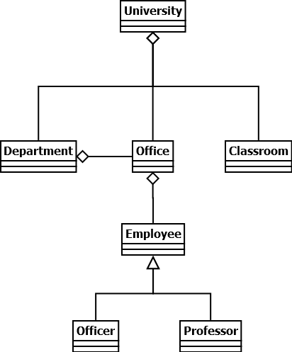
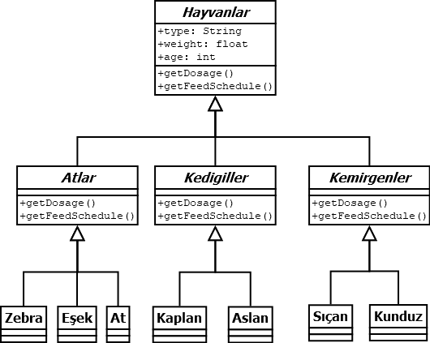
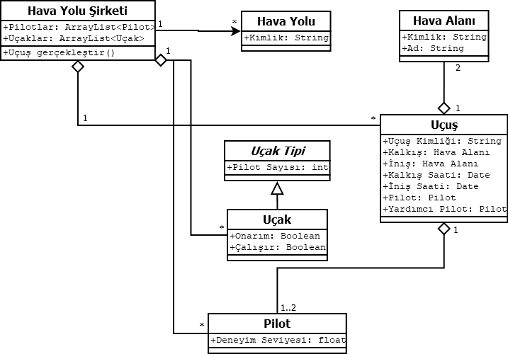
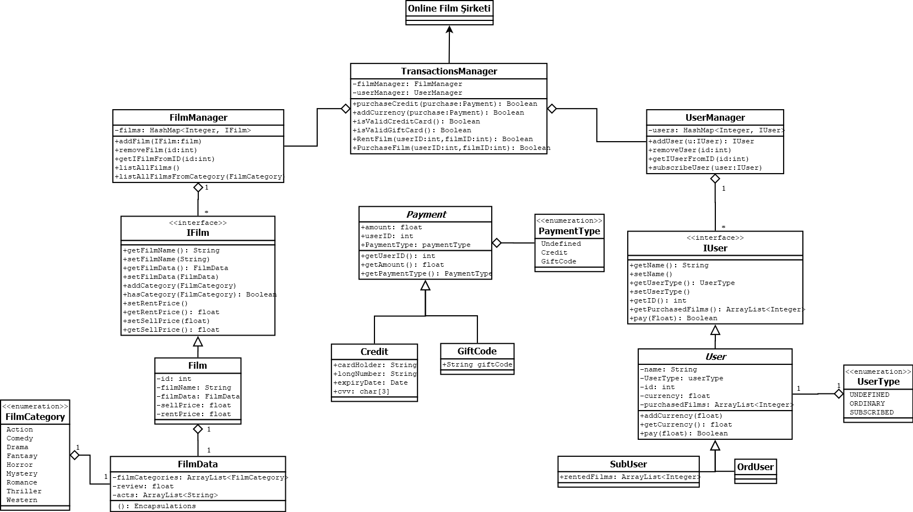

# PatikaDevOOP

Bu repo [Patika](https://patika.dev) OOP eğitimi için hazırlamış olduğum repo. UML ve OOP Java ödevlerimin soru ve cevaplarını içeriyor.

| ÖDEVLER |  |  |
|-----|-----|-----|
| [ÖDEV 1](https://github.com/furkanaliunal/PatikaDevOOP#-%C3%B6dev-1---%C3%BCniversite-y%C3%B6netim-sistemi) - Üniversite Yönetim Sistemi | [ÖDEV 2](https://github.com/furkanaliunal/PatikaDevOOP#-%C3%B6dev-2---hayvanat-bah%C3%A7esi) - Hayvanat Bahçesi | [ÖDEV 3](https://github.com/furkanaliunal/PatikaDevOOP#-%C3%B6dev-3---u%C3%A7u%C5%9F-y%C3%B6netim-sistemi) - Uçuş Yönetim Sistemi
| [ÖDEV 4](https://github.com/furkanaliunal/PatikaDevOOP#-%C3%B6dev-1---%C3%BCniversite-y%C3%B6netim-sistemi) - Online Film Sitesi | [ÖDEV 5](#) - Girilecek | [ÖDEV 6](#) - Girilecek

---

## [📖 Ödev 1 - Üniversite Yönetim Sistemi](#-%C3%B6dev-1---%C3%BCniversite-y%C3%B6netim-sistemi)
Üniversiteye ait sınıflıklar, çalışma ofisleri ve departmanlar vardır.
Departmanlara ait ofisler vardır.
Üniversiteye ait çalışanlar vardır. Bu çalışanlar profesör veya memur olabilir.
Her çalışan bir ofiste çalışır.
Bu sistemi tasvir eden Class (Sınıf) diyagramını çiziniz.

Not : Sınıflara ait nitelik ve davranışların belirtilmesine gerek yoktur.

Cevabı görmek için tıkla.

  

---

## [📖 Ödev 2 - Hayvanat Bahçesi](#-%C3%B6dev-2---hayvanat-bah%C3%A7esi)
Bir hayvanat bahçesindeki hayvanlar hakkındaki bilgileri takip etmek için bir sistem tasarlıyorsunuz.

Hayvanlar:
- Atlar (atlar, zebralar, eşekler vb.),
- Kedigiller (kaplanlar, aslanlar vb.),
- Kemirgenler (sıçanlar, kunduzlar vb.) gibi gruplardaki türlerle karakterize edilir.

Hayvanlar hakkında depolanan bilgilerin çoğu tüm gruplamalar için aynıdır.

tür adı, ağırlığı, yaşı vb.

Sistem ayrıca her hayvan için belirli ilaçların dozajını alabilmeli => getDosage ()

Sistem Yem verme zamanlarını hesaplayabilmelidir => getFeedSchedule ()

Sistemin bu işlevleri yerine getirme mantığı, her gruplama için farklı olacaktır. Örneğin, atlar için yem verme algoritması farklı olup, kaplanlar için farklı olacaktır.

Polimorfizm modelini kullanarak, yukarıda açıklanan durumu ele almak için bir sınıf diyagramı tasarlayın.

Cevabı görmek için tıkla.

  

---

## [📖 Ödev 3 - Uçuş Yönetim Sistemi](#-%C3%B6dev-3---u%C3%A7u%C5%9F-y%C3%B6netim-sistemi)
Uçuşların ve pilotların yönetimi için bir sistem tasarlayın.

- Hava yolu şirketleri uçuşları gerçekleştirir. Her hava yolunun bir kimliği vardır.

- Hava yolu şirketi, farklı tipteki uçaklara sahiptir.

- Uçaklar çalışır veya onarım durumunda olabilir.

- Her uçuşun benzersiz kimliği, kalkacağı ve ineceği havaalanı, kalkış ve iniş saatleri vardır.

- Her uçuşun bir pilotu ve yardımcı pilotu vardır ve uçağı kullanırlar.

- Havaalanlarının benzersiz kimlikleri ve isimleri vardır.

- Hava yolu şirketlerinin pilotları vardır ve her pilotun bir deneyim seviyesi mevcuttur.

- Bir uçak tipi, belirli sayıda pilota ihtiyaç duyabilir.

Bu sistemi tasvir eden Class(Sınıf) diyagramını çiziniz.

Cevabı görmek için tıkla.

  

---

## [📖 Ödev 4 - Online Film Sitesi](#-%C3%B6dev-3---u%C3%A7u%C5%9F-y%C3%B6netim-sistemi)

- Online film satan veya kiralayan uygulamanın sistemini tasarlayın.

- Uygulamada filmler listelenebilir, sıralanabilir ve kullanıcılar uygulamaya abone olabilir.

- Kullanıcılar abonelik için sistem üzerinden kredi satın alır.

- Sadece abone olan kullanıcılar, kredileri ile film kiralayabilir ve kiraladığı filmin kredi bedeli kadar hesabından düşülür.

- Normal kullanıcılar ve aboneler film satın alabilirler.

- Eğer film mevcut değil ise talep edilebilir.

- Bu sistemi tasvir eden Class(Sınıf) diyagramını çiziniz.

Cevabı görmek için tıkla.

  

